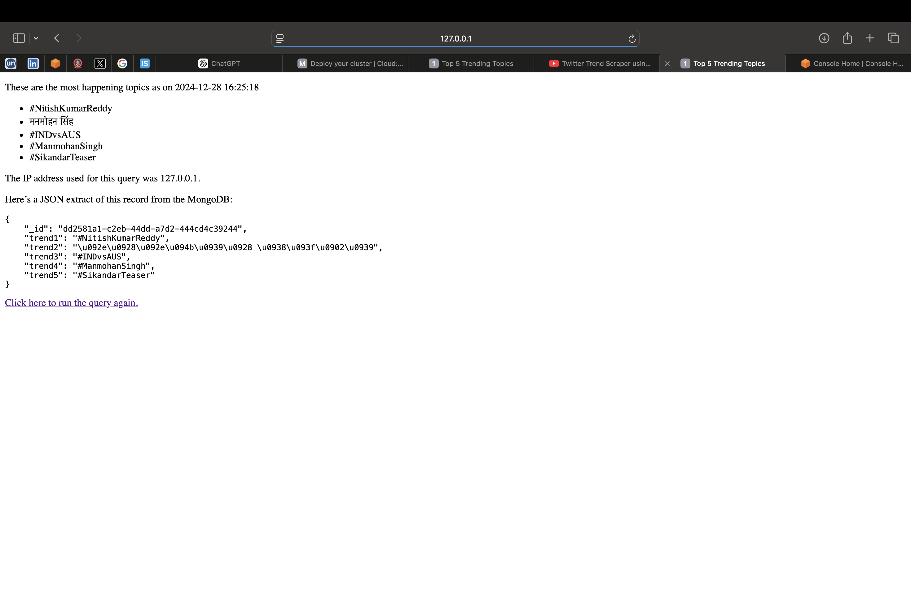
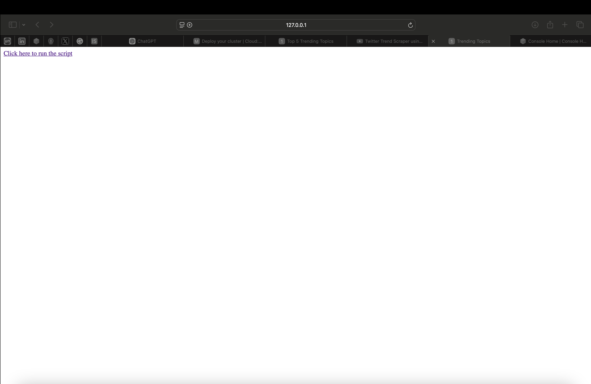

# Web Scraping with Selenium and ProxyMesh

## Overview
This project is a web scraping tool that uses Selenium for automation, ProxyMesh for rotating IP addresses, and MongoDB to store scraped data. The script extracts the top 5 trending topics from Twitter's "What's Happening" section.

## Requirements
- Python 3.x
- Selenium
- ProxyMesh account
- MongoDB (local or cloud)

## Setup

1. Clone the repository and navigate into the project directory.
2. Install the necessary dependencies:
    ```bash
    pip install selenium pymongo requests
    ```

3. Set up your ProxyMesh credentials and Twitter login details in the `scrape_trends.py` file.

4. Set up MongoDB on your local machine or use a cloud instance.

5. Run the Selenium script using the following command:
    ```bash
    python fetch_trends.py
    ```

## Project Structure

- `scrape_trends.py` - The Selenium script that scrapes the top 5 Twitter trends and stores them in MongoDB.
- `index.html` - The HTML page that triggers the scraping process.
- `top_trends.html` - The HTML page process and displays the results.
- `images/` - Folder containing project-related screenshots or diagrams.
- `README.md` - This file, explaining the project setup and usage.

## How to Run

1. Launch the Django project and visit the homepage.
2. Click the button to trigger the scraping process.
3. The results will be displayed, showing the top 5 trends and the IP address used for scraping.

## Screenshots

### Web Scraping Results
Here’s a screenshot of the top 5 trending topics fetched from Twitter using Selenium and ProxyMesh:


### Web Interface
A screenshot of the web page interface where you can trigger the scraping process:



## License
This project is licensed under the MIT License - see the [LICENSE](LICENSE) file for details.
